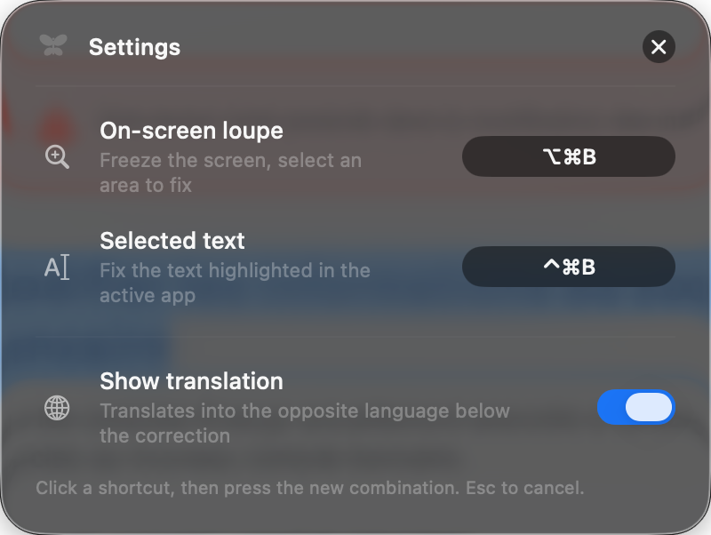

<p align="center">
  
</p>

<h1 align="center">Butterfly</h1>

<p align="center">
  Une loupe Liquid Glass pour macOS qui corrige tes fautes et traduit n'importe quel texte affiché à l'écran.<br/>
  <strong>100 % local, 100 % gratuit.</strong> Aucun texte ne quitte jamais ta machine.
</p>

<p align="center">
  
</p>

## Comment ça marche

1. Appuie sur **⌥⌘B** (Option + Cmd + B) : l'écran gèle et une loupe en verre suit ton curseur.
2. **Clique-glisse** sur n'importe quel texte (un mail, un Slack, une image, un PDF, peu importe : c'est de la reconnaissance visuelle). Échap pour annuler.
3. Un panneau en verre apparaît : texte détecté, **correction** des fautes, et **traduction**. Texte déjà sélectionnable ? **⌃⌘B** corrige directement la sélection, sans loupe.

Dans le panneau :

- La correction ne touche qu'aux fautes avérées ; si le texte est déjà parfait, un tag **« Aucune correction »** l'indique.
- Le bouton **« Régénérer une autre proposition »** en bas reformule la correction (même sens, autre tournure), autant de fois que tu veux.
- Un bouton copier sur chaque résultat, un « Voir plus » sur les textes longs, et le panneau scrolle au lieu de déborder de l'écran.

**Langues : détection automatique + presets.** La langue du texte est détectée toute seule. Chaque langue source mémorise sa cible : par défaut français → anglais et anglais → français ; si tu choisis « Allemand » dans le picker pour un texte français, tous les prochains textes français seront traduits en allemand, sans toucher au preset des autres langues.

Un clic sur l'icône papillon de la barre de menus ouvre l'**historique** de tes 50 dernières corrections, avec boutons copier. Clic droit pour le menu (moteur IA, réglages, quitter).

<p align="center">
  
</p>

## Installation

### 1. Prérequis

- **macOS 26 (Tahoe)** ou plus récent, Mac Apple Silicon
- Les Command Line Tools d'Apple : `xcode-select --install`
- [Homebrew](https://brew.sh) pour installer Ollama

### 2. Le moteur IA (gratuit, au choix)

**Option A, recommandée : Ollama + Qwen3 (open source).** Un seul téléchargement de ~2,5 Go :

```bash
brew install --cask ollama-app
ollama pull hf.co/unsloth/Qwen3-4B-Instruct-2507-GGUF:Q4_K_M
```

**Option B : Apple Intelligence**, s'il est activé sur ton Mac (Réglages Système → Apple Intelligence et Siri).

Butterfly choisit tout seul : Ollama en priorité, bascule sur Apple Intelligence sinon. Pas besoin de lancer Ollama toi-même, l'app démarre le serveur en arrière-plan quand il le faut.

### 3. Builder et installer l'app

```bash
git clone https://github.com/guillonl/butterfly.git
cd butterfly
bash scripts/build.sh
cp -R dist/Butterfly.app /Applications/
open /Applications/Butterfly.app
```

### 4. La permission d'enregistrement de l'écran

Au premier **⌥⌘B**, macOS demande l'autorisation d'enregistrement de l'écran (nécessaire pour lire le texte sous la loupe) :

1. « Ouvrir les Réglages Système » → active **Butterfly**.
2. macOS propose **« Quitter et rouvrir »** : clique ce bouton, c'est obligatoire.
3. Re-appuie sur ⌥⌘B, c'est parti.

> Note : par défaut l'app est signée localement (ad hoc). Si tu re-buildes une nouvelle version, macOS oubliera les autorisations ; purge les entrées avec `tccutil reset ScreenCapture com.leoguillon.butterfly` (et `Accessibility`) puis ré-accorde-les. Pour que les permissions survivent aux rebuilds, crée une fois un certificat local de confiance nommé « Butterfly Dev » (certificat self-signed avec l'extension codeSigning, importé et approuvé dans ton trousseau de session) : `scripts/build.sh` le détecte et signe avec automatiquement.

## Raccourcis

| Action | Geste |
|---|---|
| Corriger un texte à l'écran (loupe) | ⌥⌘B puis clique-glisse |
| Corriger le texte sélectionné | sélectionne du texte dans n'importe quelle app, puis ⌃⌘B |
| Personnaliser les deux raccourcis | clic droit sur l'icône → Réglages… |
| Annuler la sélection | Échap |
| Historique | Clic sur l'icône papillon |
| Menu (moteur IA, réglages, quitter) | Clic droit sur l'icône |
| Fermer un panneau | Échap ou clic ailleurs |

Le raccourci « texte sélectionné » saute la loupe et l'OCR : il lit directement la sélection de l'app active (via l'API Accessibilité, avec repli sur une copie silencieuse qui restaure ton presse-papiers). Il demande une permission supplémentaire au premier usage : Réglages Système → Confidentialité et sécurité → **Accessibilité** → activer Butterfly.

### Réglages

Clic droit sur l'icône papillon → **Réglages…** :

- **Raccourcis personnalisables** : clique un raccourci puis tape la nouvelle combinaison (au moins ⌘, ⌥ ou ⌃).
- **Afficher la traduction** : un toggle pour désactiver complètement la traduction si tu ne veux que la correction (plus rapide).

<p align="center">
  
</p>

## Vie privée et sécurité

Tout tourne sur ta machine : la capture d'écran, l'OCR (Vision d'Apple), la correction et la traduction (modèle local via Ollama sur 127.0.0.1 ou Apple Intelligence on-device). Aucune requête réseau vers un service externe, aucune télémétrie, aucune clé API.

À savoir :

- Les captures d'écran restent en mémoire le temps de l'analyse, elles ne sont jamais écrites sur disque.
- L'**historique** (50 dernières corrections) est stocké en clair dans les préférences locales de ton compte ; le bouton corbeille du panneau le purge entièrement. Évite d'analyser des secrets (mots de passe…) si d'autres comptes utilisent ta machine.
- Le repli « copie silencieuse » du raccourci sélection restaure ton presse-papiers, mais un gestionnaire de presse-papiers tiers peut avoir enregistré le texte au passage.
- L'app est signée avec le Hardened Runtime activé (anti-injection de code) et le binaire ne charge aucune dépendance tierce (zéro package externe).

## Pour les devs

```bash
swift build -c release                     # build
./.build/release/Butterfly --selftest      # test du moteur IA bout en bout (FR↔EN)
./.build/release/Butterfly --demo          # panneau résultat avec données fictives
./.build/release/Butterfly --demo-overlay  # ouvre l'overlay loupe au lancement
./.build/release/Butterfly --demo-history  # ouvre l'historique avec données fictives
swift scripts/make_icon.swift              # regénérer l'icône papillon
```

Architecture : `HotKeyManager` (hotkey Carbon, zéro permission) → `ScreenCaptureService` (ScreenCaptureKit, écran gelé) → `OverlayView` (loupe SwiftUI) → `OCRService` (Vision) → `TextEngine` (Ollama / Apple FoundationModels, streaming) → panneaux SwiftUI en `glassEffect`.

## Licence

[MIT](LICENSE) © 2026 Léo Guillon
