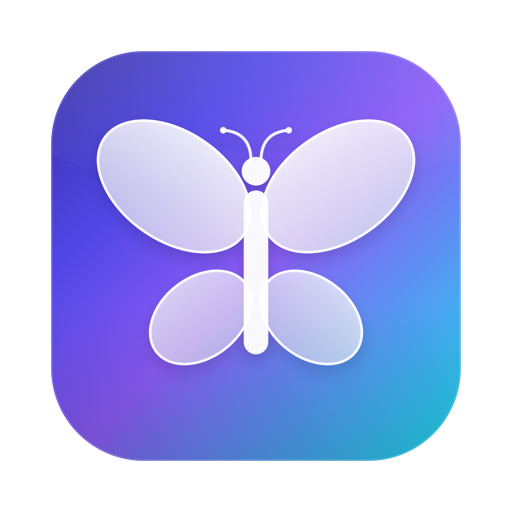
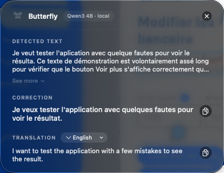
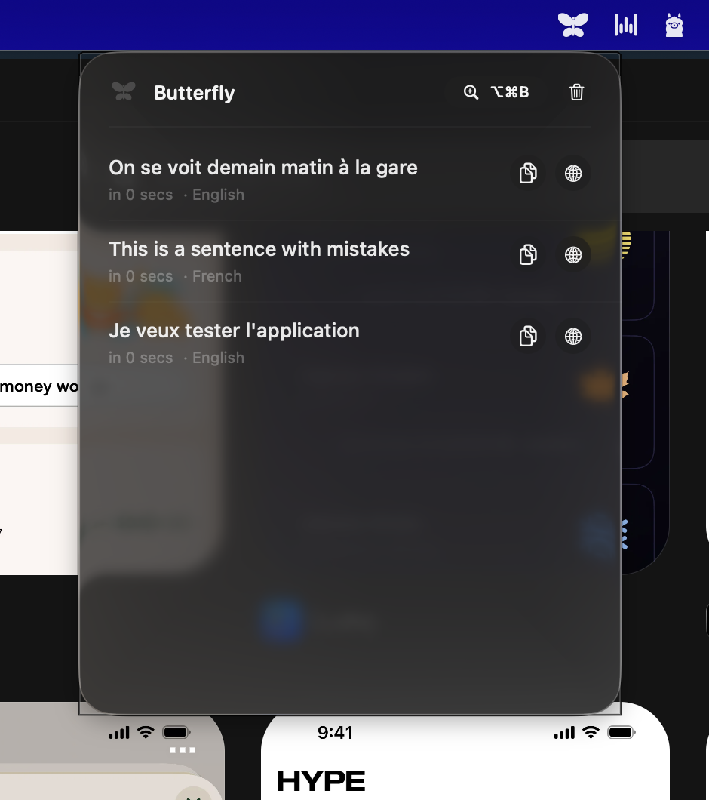

<p align="center">
  
</p>

<h1 align="center">Butterfly</h1>

<p align="center">
  Une loupe Liquid Glass pour macOS qui corrige tes fautes et traduit n'importe quel texte affiché à l'écran.<br/>
  <strong>100 % local, 100 % gratuit.</strong> Aucun texte ne quitte jamais ta machine.
</p>

<p align="center">
  
</p>

## Comment ça marche

1. Appuie sur **⌥⌘B** (Option + Cmd + B) : l'écran gèle et une loupe en verre suit ton curseur.
2. **Clique-glisse** sur n'importe quel texte (un mail, un Slack, une image, un PDF, peu importe : c'est de la reconnaissance visuelle). Échap pour annuler.
3. Un panneau en verre apparaît : texte détecté, **correction** des fautes, et **traduction**.

La langue est détectée automatiquement : un texte en anglais est corrigé en anglais et traduit en français, un texte en français est corrigé en français et traduit en anglais. Le menu de langue du panneau permet de forcer une autre cible (espagnol, allemand, italien, portugais).

Un clic sur l'icône papillon de la barre de menus ouvre l'**historique** de tes 50 dernières corrections, avec boutons copier. Clic droit pour le menu (choix du moteur IA, quitter).

<p align="center">
  
</p>

## Installation

### 1. Prérequis

- **macOS 26 (Tahoe)** ou plus récent, Mac Apple Silicon
- Les Command Line Tools d'Apple : `xcode-select --install`
- [Homebrew](https://brew.sh) pour installer Ollama

### 2. Le moteur IA (gratuit, au choix)

**Option A, recommandée : Ollama + Qwen3 (open source).** Un seul téléchargement de ~2,5 Go :

```bash
brew install --cask ollama-app
ollama pull hf.co/unsloth/Qwen3-4B-Instruct-2507-GGUF:Q4_K_M
```

**Option B : Apple Intelligence**, s'il est activé sur ton Mac (Réglages Système → Apple Intelligence et Siri).

Butterfly choisit tout seul : Ollama en priorité, bascule sur Apple Intelligence sinon. Pas besoin de lancer Ollama toi-même, l'app démarre le serveur en arrière-plan quand il le faut.

### 3. Builder et installer l'app

```bash
git clone https://github.com/guillonl/butterfly.git
cd butterfly
bash scripts/build.sh
cp -R dist/Butterfly.app /Applications/
open /Applications/Butterfly.app
```

### 4. La permission d'enregistrement de l'écran

Au premier **⌥⌘B**, macOS demande l'autorisation d'enregistrement de l'écran (nécessaire pour lire le texte sous la loupe) :

1. « Ouvrir les Réglages Système » → active **Butterfly**.
2. macOS propose **« Quitter et rouvrir »** : clique ce bouton, c'est obligatoire.
3. Re-appuie sur ⌥⌘B, c'est parti.

> Note : l'app est signée localement (ad hoc). Si tu re-buildes une nouvelle version, macOS oubliera l'autorisation ; purge l'entrée avec `tccutil reset ScreenCapture com.leoguillon.butterfly` puis ré-accorde-la.

## Raccourcis

| Action | Geste |
|---|---|
| Corriger un texte à l'écran (loupe) | ⌥⌘B puis clique-glisse |
| Corriger le texte sélectionné | sélectionne du texte dans n'importe quelle app, puis ⌃⌘B |
| Personnaliser les deux raccourcis | clic droit sur l'icône → Réglages… |
| Annuler la sélection | Échap |
| Historique | Clic sur l'icône papillon |
| Menu (moteur IA, réglages, quitter) | Clic droit sur l'icône |
| Fermer un panneau | Échap ou clic ailleurs |

Le raccourci « texte sélectionné » saute la loupe et l'OCR : il lit directement la sélection de l'app active (via l'API Accessibilité, avec repli sur une copie silencieuse qui restaure ton presse-papiers). Il demande une permission supplémentaire au premier usage : Réglages Système → Confidentialité et sécurité → **Accessibilité** → activer Butterfly.

## Vie privée

Tout tourne sur ta machine : la capture d'écran, l'OCR (Vision d'Apple), la correction et la traduction (modèle local via Ollama ou Apple Intelligence). Aucune requête réseau vers un service externe, aucune télémétrie.

## Pour les devs

```bash
swift build -c release                     # build
./.build/release/Butterfly --selftest      # test du moteur IA bout en bout (FR↔EN)
./.build/release/Butterfly --demo          # panneau résultat avec données fictives
./.build/release/Butterfly --demo-overlay  # ouvre l'overlay loupe au lancement
./.build/release/Butterfly --demo-history  # ouvre l'historique avec données fictives
swift scripts/make_icon.swift              # regénérer l'icône papillon
```

Architecture : `HotKeyManager` (hotkey Carbon, zéro permission) → `ScreenCaptureService` (ScreenCaptureKit, écran gelé) → `OverlayView` (loupe SwiftUI) → `OCRService` (Vision) → `TextEngine` (Ollama / Apple FoundationModels, streaming) → panneaux SwiftUI en `glassEffect`.

## Licence

[MIT](LICENSE) © 2026 Léo Guillon
