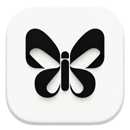
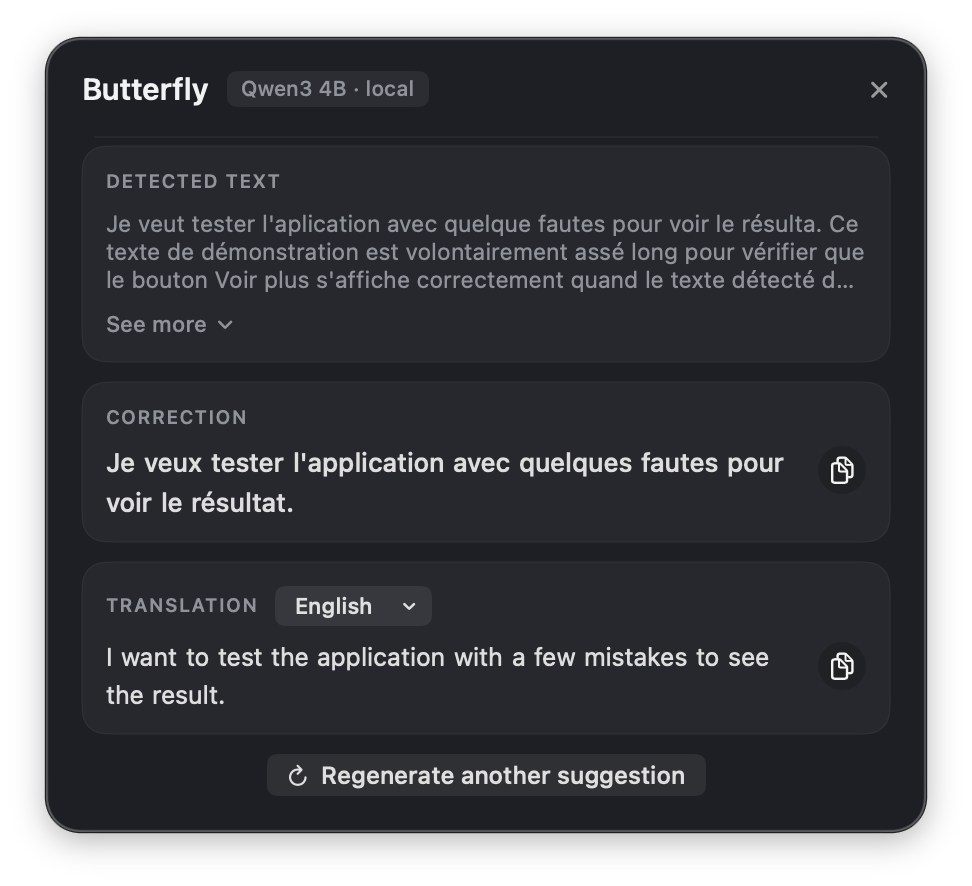
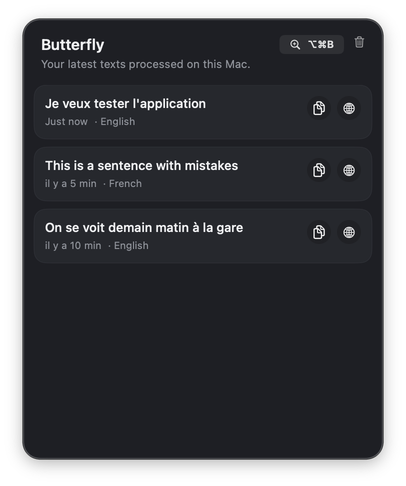
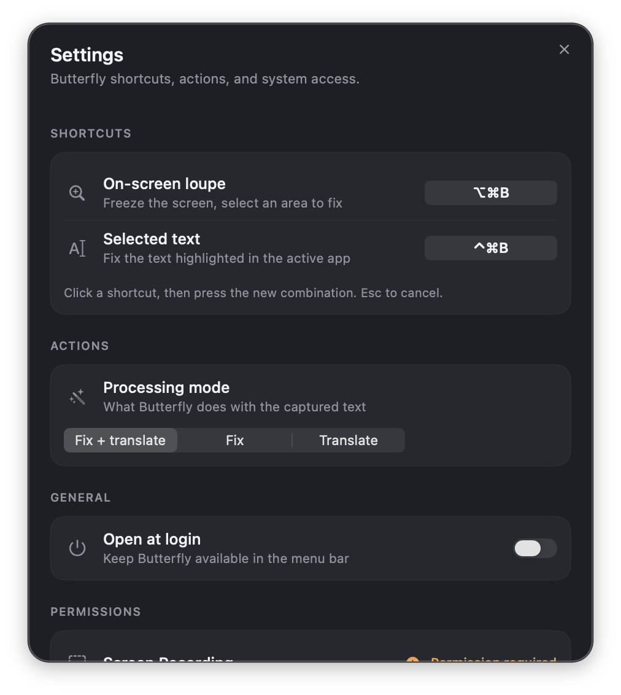

<p align="center">
  
</p>

<h1 align="center">Butterfly</h1>

<p align="center">
  Une loupe Liquid Glass pour macOS qui corrige tes fautes et traduit n'importe quel texte affiché à l'écran.<br/>
  <strong>100 % local, 100 % gratuit.</strong> Aucun texte ne quitte jamais ta machine.
</p>

<p align="center">
  
</p>

## Comment ça marche

1. Appuie sur **⌥⌘B** (Option + Cmd + B) : l'écran gèle et une loupe en verre suit ton curseur.
2. **Clique-glisse** sur n'importe quel texte (un mail, un Slack, une image, un PDF, peu importe : c'est de la reconnaissance visuelle). Échap pour annuler.
3. Un panneau en verre apparaît : texte détecté, **correction** des fautes, et **traduction**. Texte déjà sélectionnable ? **⌃⌘B** corrige directement la sélection, sans loupe.

Dans le panneau :

- La correction ne touche qu'aux fautes avérées ; si le texte est déjà parfait, un tag **« Aucune correction »** l'indique.
- Le bouton **« Régénérer une autre proposition »** en bas reformule la correction (même sens, autre tournure), autant de fois que tu veux.
- Un bouton copier sur chaque résultat, un « Voir plus » sur les textes longs, et le panneau scrolle au lieu de déborder de l'écran.

**Langues : détection automatique + presets.** La langue du texte est détectée toute seule. Chaque langue source mémorise sa cible : par défaut français → anglais et anglais → français ; si tu choisis « Allemand » dans le picker pour un texte français, tous les prochains textes français seront traduits en allemand, sans toucher au preset des autres langues.

Un clic sur l'icône papillon de la barre de menus ouvre l'**historique** de tes 50 dernières corrections, avec boutons copier. Clic droit pour le menu (moteur IA, réglages, quitter).

<p align="center">
  
</p>

## Installation

### 1. Le plus simple : le DMG

1. Télécharge **`Butterfly.dmg`**, ouvre-le, et glisse **Butterfly** dans le dossier **Applications**.
2. Au premier lancement, macOS bloque les apps qui ne viennent pas de l'App Store. C'est normal :
   - Double-clique **Butterfly** → un message apparaît → clique **« OK »** (pas « Mettre à la corbeille »).
   - Va dans **Réglages Système → Confidentialité et sécurité**, descends jusqu'à la section **Sécurité**, et clique **« Ouvrir quand même »** à côté de Butterfly, puis confirme.
   - C'est à faire **une seule fois**. (Sur macOS 15+ le clic droit → Ouvrir ne suffit plus, il faut bien passer par les Réglages.)
3. Butterfly t'accueille avec un **guide de démarrage** : il vérifie le moteur d'intelligence et te guide pour les autorisations, avec un bouton pour chaque étape.

### 2. Le moteur d'intelligence

Butterfly utilise en priorité **Apple Intelligence**, l'IA intégrée à macOS : **rien à installer, rien à télécharger**, tout reste sur ton Mac. Il suffit qu'Apple Intelligence soit activé (Réglages Système → **Apple Intelligence et Siri**) — le guide de démarrage propose un bouton pour le faire.

> **Option avancée — Ollama.** Sur un Mac qui ne prend pas en charge Apple Intelligence, ou si tu préfères un modèle open source (Qwen3 4B), installe Ollama et Butterfly l'utilisera automatiquement :
> ```bash
> brew install --cask ollama-app
> ollama pull hf.co/unsloth/Qwen3-4B-Instruct-2507-GGUF:Q4_K_M
> ```
> Pas besoin de lancer Ollama toi-même, l'app démarre le serveur en arrière-plan quand il le faut.

### 3. Les autorisations

Au premier usage, macOS demande deux autorisations (le guide de démarrage propose un bouton pour chacune) :

- **Enregistrement de l'écran** — pour lire le texte sous la loupe (⌥⌘B). macOS proposera **« Quitter et rouvrir »** : clique ce bouton, c'est obligatoire.
- **Accessibilité** — pour corriger le texte sélectionné dans une autre app (⌃⌘B).

## Installer depuis les sources

```bash
git clone https://github.com/guillonl/butterfly.git
cd butterfly
bash scripts/build.sh                       # → dist/Butterfly.app (signé localement)
cp -R dist/Butterfly.app /Applications/
bash scripts/make_dmg.sh                     # → dist/Butterfly-<version>.dmg (drag-and-drop)
```

> **Signature & permissions.** L'app est signée localement (ad hoc, ou avec un certificat self-signed « Butterfly Dev »). Elle n'est **pas notarisée** : le DMG reste donc soumis à l'étape Gatekeeper ci-dessus chez les destinataires. Pour une distribution sans aucun avertissement, il faudrait un compte Apple Developer (Developer ID + notarisation). Si tu re-buildes, purge au besoin les autorisations avec `tccutil reset ScreenCapture com.leoguillon.butterfly` (et `Accessibility`). Pour que les permissions survivent aux rebuilds, crée une fois un certificat local « Butterfly Dev » (self-signed, extension codeSigning, approuvé dans ton trousseau) : `scripts/build.sh` le détecte et signe avec automatiquement.
>
> **Tester une version côte à côte.** Pour installer une « Butterfly Beta » sans toucher à ta version stable (bundle id, préférences et permissions séparés) :
> ```bash
> BUTTERFLY_APP_NAME="Butterfly Beta" BUTTERFLY_BUNDLE_ID="com.leoguillon.butterfly.beta" bash scripts/build.sh
> cp -R "dist/Butterfly Beta.app" /Applications/
> ```
> Quitte l'une quand tu testes l'autre : les deux partagent les mêmes raccourcis par défaut (⌥⌘B / ⌃⌘B).

## Raccourcis

| Action | Geste |
|---|---|
| Corriger un texte à l'écran (loupe) | ⌥⌘B puis clique-glisse |
| Corriger le texte sélectionné | sélectionne du texte dans n'importe quelle app, puis ⌃⌘B |
| Personnaliser les deux raccourcis | clic droit sur l'icône → Réglages… |
| Annuler la sélection | Échap |
| Historique | Clic sur l'icône papillon |
| Menu (moteur IA, réglages, quitter) | Clic droit sur l'icône |
| Fermer un panneau | Échap ou clic ailleurs |

Le raccourci « texte sélectionné » saute la loupe et l'OCR : il lit directement la sélection de l'app active (via l'API Accessibilité, avec repli sur une copie silencieuse qui restaure ton presse-papiers). Il demande une permission supplémentaire au premier usage : Réglages Système → Confidentialité et sécurité → **Accessibilité** → activer Butterfly.

### Réglages

Clic droit sur l'icône papillon → **Réglages…** :

- **Raccourcis personnalisables** : clique un raccourci puis tape la nouvelle combinaison (au moins ⌘, ⌥ ou ⌃).
- **Afficher la traduction** : un toggle pour désactiver complètement la traduction si tu ne veux que la correction (plus rapide).

<p align="center">
  
</p>

## Vie privée et sécurité

Tout tourne sur ta machine : la capture d'écran, l'OCR (Vision d'Apple), la correction et la traduction (modèle local via Ollama sur 127.0.0.1 ou Apple Intelligence on-device). Aucune requête réseau vers un service externe, aucune télémétrie, aucune clé API.

À savoir :

- Les captures d'écran restent en mémoire le temps de l'analyse, elles ne sont jamais écrites sur disque.
- L'**historique** (50 dernières corrections) est stocké en clair dans les préférences locales de ton compte ; le bouton corbeille du panneau le purge entièrement. Évite d'analyser des secrets (mots de passe…) si d'autres comptes utilisent ta machine.
- Le repli « copie silencieuse » du raccourci sélection restaure ton presse-papiers, mais un gestionnaire de presse-papiers tiers peut avoir enregistré le texte au passage.
- L'app est signée avec le Hardened Runtime activé (anti-injection de code) et le binaire ne charge aucune dépendance tierce (zéro package externe).

## Pour les devs

```bash
swift build -c release                     # build
./.build/release/Butterfly --selftest      # test du moteur IA bout en bout (FR↔EN)
./.build/release/Butterfly --demo          # panneau résultat avec données fictives
./.build/release/Butterfly --demo-overlay  # ouvre l'overlay loupe au lancement
./.build/release/Butterfly --demo-history  # ouvre l'historique avec données fictives
./.build/release/Butterfly --demo-onboarding # ouvre le guide de démarrage
./.build/release/Butterfly --test-resize   # test du resize du panneau (sans souris)
./.build/release/Butterfly --test-replace  # test du remplacement de mot
swift scripts/make_icon.swift              # regénérer l'icône papillon
swift scripts/make_dmg_background.swift    # regénérer le fond du DMG
```

Architecture : `HotKeyManager` (hotkey Carbon, zéro permission) → `ScreenCaptureService` (ScreenCaptureKit, écran gelé) → `OverlayView` (loupe SwiftUI) → `OCRService` (Vision) → `TextEngine` (Apple FoundationModels en priorité, Ollama en secours, streaming) → panneaux SwiftUI en `glassEffect`.

## Licence

[MIT](LICENSE) © 2026 Léo Guillon
